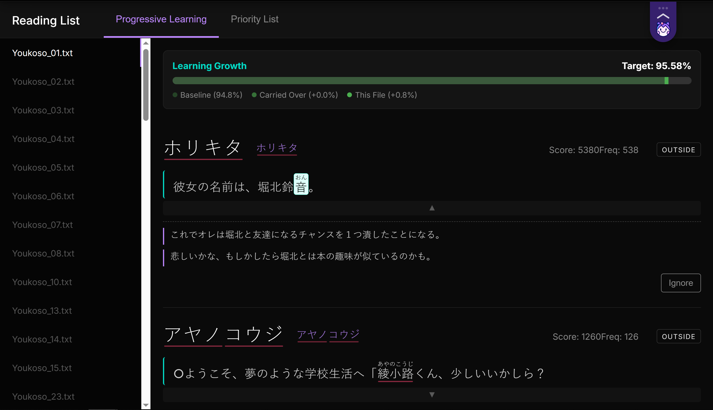
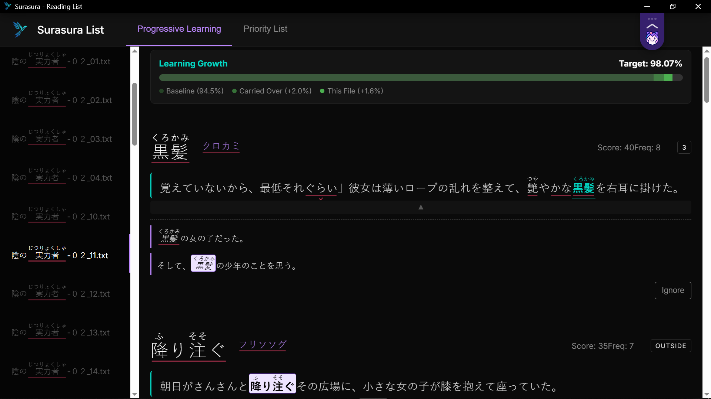
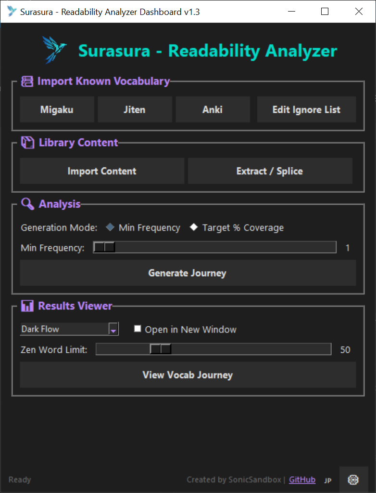
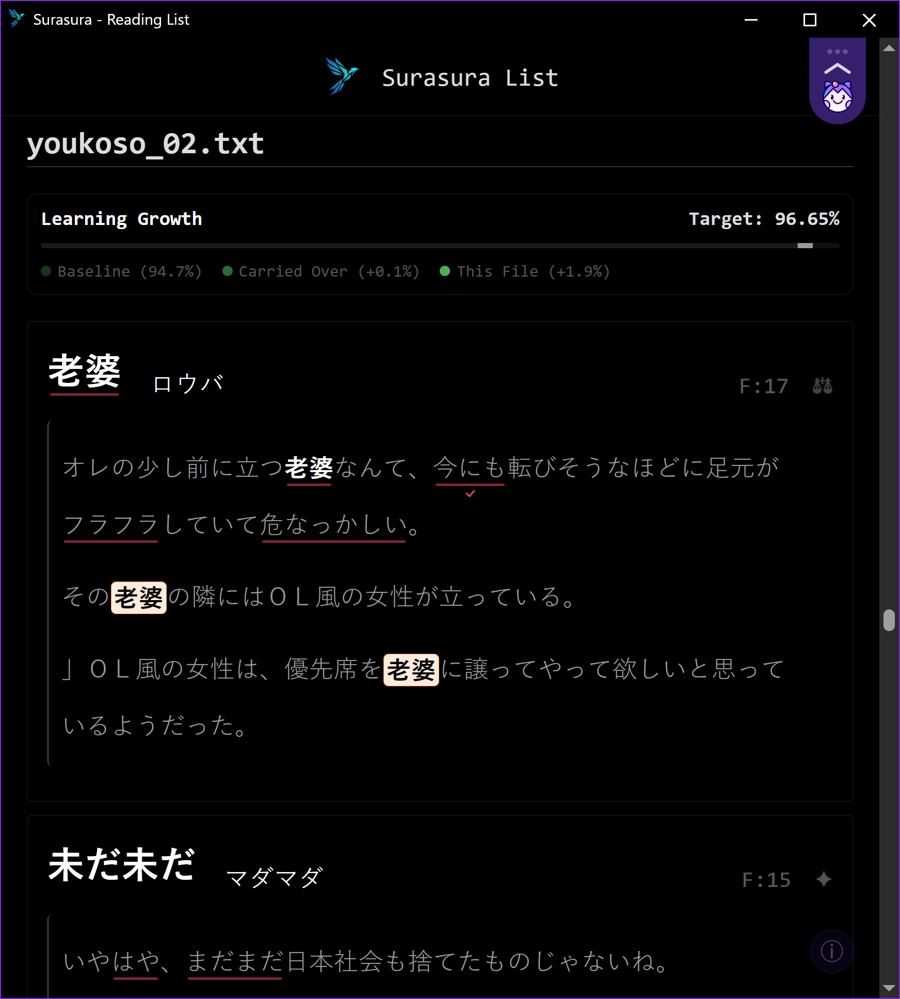

#  Surasura (スラスラ) - Readability Analyzer
 

*For Intermediate-Advanced learners. Supports Japanese & Chinese...* 



> **The only frequency list that matters is the one based on YOUR watch / read list.**

A tool that generates THAT list, and gives you the episode-by-episode (or chapter) *highest-leverage* order order based on:

- your known vocabulary
- your immersion content 
- your word frequency

After analyzing, it will generate a study plan with curated examples. 
Optimizes the order you learn words. Easy sentence mining for Anki or Migaku.

## 🎯 Why? - The Diminishing Returns of Vocab

> **The only frequency list that matters is the one based on YOUR watch / read list.**

Otherwise you're wasting time learning words you'll just forget.

Useful if you:

- Hit 5000+ words

- Have limited immersion time

- Are tired of adding words you'll never see

- Want to see mulitple examples and pick the best one

- Enjoy seeing your progress %

- Like using physical books


Use Surasura to know every word you learn is immediately relevant to your content goals.

### 🏆 Features

- 🗄️ **Migaku, Anki & Jiten Sync**: Import known words from Migaku, Anki Decks or Jiten.moe.

- 📖 **EPUB & Anki Extractor**: Extract and split text from Japanese EPUBs or Anki decks.

- 🔤 **Advanced Analyzer**: Tokenize text using Fugashi/Unidic-lite and calculate comprehension scores.

- 🧮 **Progress Tracking**: Track your progress % before AND after watching/reading.

- 🧘 **Zen Mode**: A distraction-free mode for focused learning.

- 📊 **Vocab List Dashboard**: Generates an interactive HTML dashboard to learn and add words to Migaku or Anki.

- 🎨 **Enhanced Themes**: Multiple curated themes (Zen Focus, Midnight Vibrant, etc.).

- 🇨🇳 **Multi-Language Support**: Now also supports Chinese (Simplified & Traditional) via Jieba segmentation.

- 📚 **Physical Book Support**: Add the EPUB, study, and immerse without ever needing to look up a word again.

- 🚀 **Custom Freq List**: Generate your own frequency list from your immersion content to use with Migaku / Yomitan, etc.


### Current Limitations
- Only executable for Windows (macOS/Linux can run from source)
- Occasional Wacky Parsing
- 'Ignore' only adds to clipboard

## 📥 Latest Release Zip

Download the latest release zip file from the [Releases page](https://github.com/SonicSandbox/surasura/releases).

> **Quick Start:** Download -> Extract -> Run `Surasura.exe`

## Screenshots
> Dashboard with Migaku extension




| Dashboard Overview | Zen Mode |
| :---: | :---: |
|  |  |

## 🚀 Get Started

1. Run `Surasura.exe` to launch the application.

2. Use the **Word Importer** to set up your known words.

3. Place your text files in the corresponding folders:

- data/HighPriority: Content you are consuming today.

- data/LowPriority: Content for next week or next month.

- data/GoalContent: Aspirations or "someday" books.

4. Click **Run Analysis** to generate your reports.

5. View results via **View Vocab Journey**.


## 🛠️ Running from Source
If you prefer to run Surasura from source rather than using the pre-built executable:

### 1. Requirements
- Python 3.9 or higher.
- (Windows only) Ensure `tkinter` is installed (usually bundled with Python).

### 2. Setup
1. Clone the repository: `git clone https://github.com/SonicSandbox/surasura.git`
2. Install dependencies:
   ```bash
   pip install -r requirements.txt
   ```

### 3. Launching
Run the master entry point:
```bash
python app_entry.py
```
This dispatcher ensures the correct environment is set up and launches the main dashboard.

## 🛠️ Building the Application
To create your own standalone executable:

1. Ensure you have the dev dependencies installed:
   ```bash
   pip install pyinstaller
   ```
This will clean previous builds, run PyInstaller with the correct configurations, and create a ready-to-use package in `dist/Surasura_v1.2`.

## 📂 Project Structure
- `app/`: Core application scripts and GUI modules.
- `app_entry.py`: Main entry point and dispatcher.
- `package_app.py`: Build and packaging script.
- `scripts/`: Shared utilities and data conversion scripts.
- `templates/`: HTML templates for visualization.
- `data/`: Input text files (Place your TXT/SRT files here).
- `User Files/`: Configuration and frequency lists.
- `results/`: Generated CSVs and HTML reports.

## 🤝 Support & Issues

Encountered a bug or have a feature request? Please search the [Issues](https://github.com/SonicSandbox/surasura/issues) page to see if it's already being worked on. If not, feel free to open a new issue.

## 💡 Motivation
*I was tired of learning words I never see, and I also like reading physical books. Otherwise, mining from physical books is a pain.* Surasura solves that friction.

## 📜License

Distributed under the MIT License. See `LICENSE` for more information.
