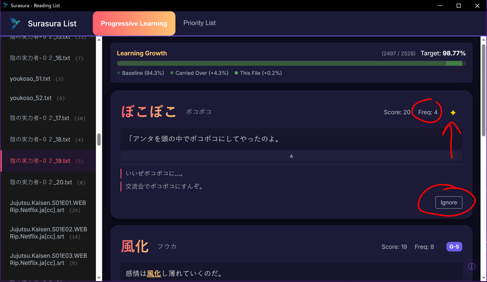

# Setup and Usage Tutorial

## What are we doing?
-> Importing your existing knowledge
-> Adding your personal immersion library
-> Creating your personal frequency list
-> Learning your highest frequency words, episode by episode *(chapter by chapter)*

> Surasura shows you the exact words worth your time. In the perfect order.

## 1. Import Known Vocabulary
First, import your existing knowledge. The analyzer will use this to calculate your known % and skip words you already know.

## 2. Splitting Content & Graduation
Before adding content to your library, you need to prepare it.

1.  **Find your EPUBs**, subtitles, Anki Immersion Decks, or text files.
2.  **Split them** using the Splitting tool. 

## 3. Organizing Your Folders
Once your files are split, add them to the correct location in your content folders. Order matters!

*   **NOW: Next 2 weeks**: What you are consuming *today* and in the next 2 weeks.
*   **Next 6 Months**: Your medium-term reading / watch list.
*   **Goal**: Content for *after* 6 months.

> **Note:** You can include as much content as you like! The analysis will handle it comfortably, as long as you understand the timeframes you've set for yourself.

## 4. Importing & Managing Files
You can easily import files and move them around. Drag and drop functionality is supported for prioritizing your content.

## 5. Two Modes
The application runs in two main modes:
1.  **Frequency Mode**: (Recommended) Orders based on the Highest frequency from YOUR immersion content.

2.  **% Coverage Mode**: Includes as many words to get you to 100% coverage of your immersion content. *(Still prioritizes based on frequency)*

## 6. Understanding the Output
The analysis report provides specific metrics to guide your learning:

*   **Order to Learn**: Suggested learning order based on importance.
*   **Frequency**: How often the word appears in your content.

*   **Diamond (Priority)** 🔹: Words you will see throughout all of your content.
*   **Lopsided** ⚖: Words you will see in the next 2 weeks, but rarely after.

*   **Ignore Word**: Options to ignore specific words from future analysis.
*   **Other Freq Lists**: Tagging from other Freq lists

