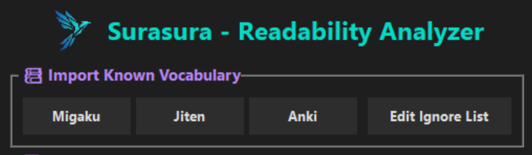
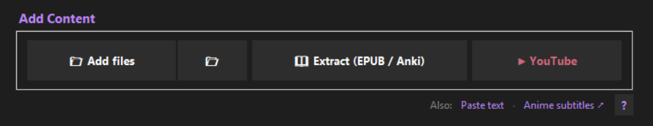
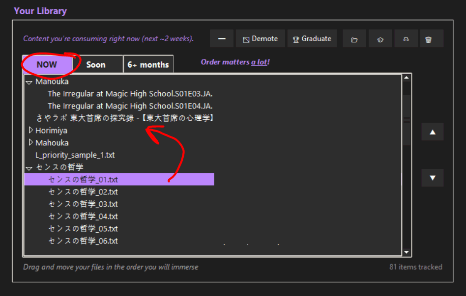
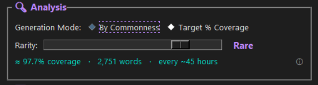
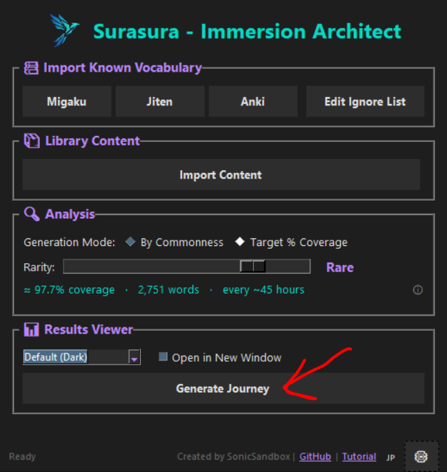
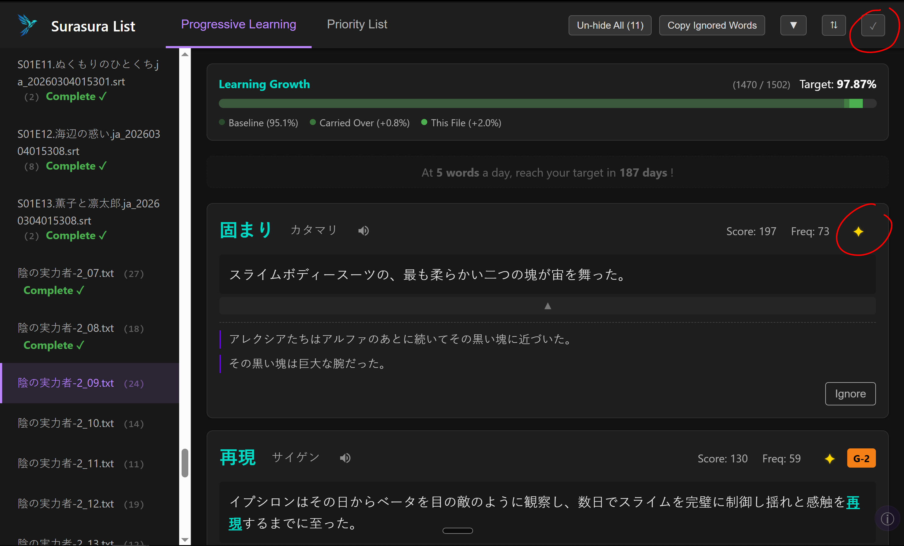
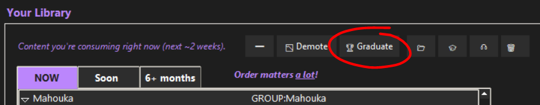
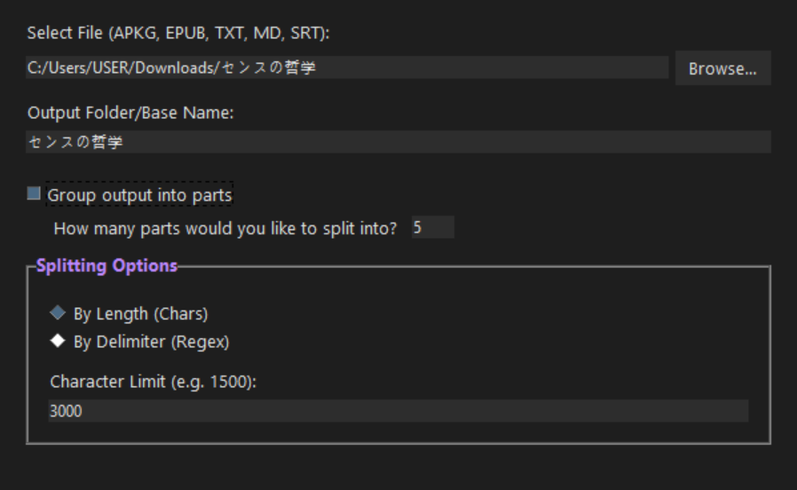
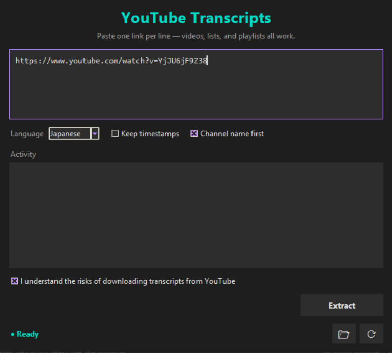
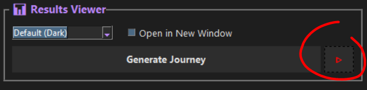

# Setup and Usage Tutorial

## What are we doing?
-> Importing your **existing knowledge**

-> Adding your **personal immersion library**

-> Creating your **personal frequency list**

-> Learning your highest-leverage words, episode by episode *(chapter by chapter)*

> Surasura shows you the exact words worth your time. In the perfect order.

## 1. Import Known Vocabulary
First, import your existing knowledge. The analyzer uses this to calculate your known % and skip words you already know.

*   **Migaku / Jiten / Anki** — pull known words straight from your decks or exports.
*   **Anki, live** — with Anki open (and the AnkiConnect add-on), press **Anki → Sync now**. Only cards you've studied count, and it can keep itself up to date automatically.
*   **Edit Ignore List** — hand-exclude words you never want suggested.

## 2. Import Content
Press **Import Content** to open the Content Manager — one place to add and organize everything.

*   **📁 Add files & Folders** — drop in ready `.txt` / `.md` / `.srt` / `.ass`
*   **📖 Extract (EPUB / Anki)** — turn an EPUB or Anki deck into clean, split text.
*   **▶ YouTube** *(optional)* — pull transcripts straight from YouTube.

## 3. Order Your Library
Your library is split into three tabs. 

Added content lands in the tab you're on. **Order matters** — drag files (and use ▲▼) into the order you'll actually immerse.

*   **NOW**: what you're consuming *today* and over the next ~2 weeks. *(Order matters a lot.)*
*   **Soon**: your medium-term list (within 6 months). *(Order matters a little.)*
*   **6+ months**: someday / aspirational content. *(Order doesn't matter.)*

> Include as much as you like — the analysis handles it comfortably, as long as the timeframes reflect your real plans.

## 4. Choose How to Generate
Two modes drive the word list:

1.  **By Commonness** *(RECOMMENDED)* — a slider from **Core** (only the most common words) to **Native** (everything but one-offs). Slide to include rarer words; a live preview shows the word count and coverage % you'd reach.

2.  **Target % Coverage** — include enough words to hit a coverage % of your content. *(Still ordered by leverage.)*

## 5. Generate Your Journey
Press **Generate Journey** to build your list and see the report.

If no changes, it reuses the last analysis, so theme tweaks are instant.

## 6. Understanding the Output
The report orders words by real payoff across *your* library:

*   **Order to Learn** — suggested order, by importance.
*   **Frequency** — how often the word appears in your content.
*   **Star (Priority)** ✦ — high-leverage words you'll see throughout all of your content.
*   **Lopsided** ⚖ — words you'll see a lot in the next 2 weeks, but rarely after.
*   **Reading word** 文 — a word you'll meet in text but will rarely *hear*, so it's worth a reading-first card.
*   **Show filter** (⇅) — focus the list on **All**, **✦** only, **No ✦**, **文** only, or **No 文**.
*   **🔍 Search** — a tab beside **Priority List** (press **/** from anywhere): any word, and every sentence that uses it.
*   **Mark Complete** (✓) — tick off a file you've finished; it advances you to the next.
*   **Ignore Word / Other Freq Lists** — exclude words, or see tags from imported frequency lists.

## 7. Graduating Content
Once you've learned a file's vocabulary AND *consumed it*, **Graduate** it. This keeps your analysis fresh and honest about your progress.

*   **Move to Known** — words in graduated content become "Known" and drop out of future journeys. You've conquered them!
*   **Progressive Graduation** — as goals shift, promote content into sooner tabs (e.g. **Soon → NOW**).

## Additional Features

### Splitting Content (Extract)
Big EPUBs and Anki decks are best split into episode- / chapter-sized files. **📖 Extract (EPUB / Anki)** handles it:

*   Set a split length (or split into N parts) — clean `.txt` chunks land in **Processed** *and* your active tab.
*   For Anki decks, pick the field to pull text from.

### YouTube Downloader *(optional)*
Feed Surasura straight from YouTube. Press **▶ YouTube** in the Content Manager:

*   Paste any links — single videos, pasted lists, or full playlists.
*   Choose the caption language, and optionally **keep timestamps**.
*   Clean `.txt` transcripts drop into **Processed** and your active tab, ready to analyze.

> A one-time acknowledgment is required before your first download.

### YouTube Preview *(optional)*
"Try before you watch." Press **▷** next to **Generate Journey**:

*   Paste a video (or playlist) link to see its Vocab Journey scored against *your* library — how much you already know, and exactly what it would teach you — with no full re-run.
*   For a playlist, each video is scored on its own so you can compare head-to-head.
*   Like it? One checkbox adds the transcript to the front of **NOW** for future runs.

### 🔍 Search Your Report
Open the **🔍** tab (or press **/** anywhere in the report) and type a word:

*   The word's own card comes first, then every other word whose example sentences contain it.
*   Search 食べる and you also get sentences that say 食べた or 食べて — only forms that really occur in your content.
*   Hiragana or katakana both work, and clicking any result searches for that word instead.

### Where a Sentence Came From
Turn on **Settings → 📊 Experience & UI → Sentence source** and each example sentence gets a small badge:

*   Hover to see the file (and, for subtitles, the moment it's spoken); click to copy its path.
*   For a YouTube transcript, clicking opens the video at that moment; shift-click opens the transcript.

### Look Up a Word (⌕)
Each card has a **⌕** button (or press **\\**) that searches the word on Nadeshiko for more real-world sentences. Choose anime, live action, YouTube or everything under **Settings → 📊 Experience & UI → Lookup examples from**, or hide the button there.

### 順 Junban — Put Your Anki Backlog in Order *(optional)*
Mine as much as you like, then press **順** at the bottom of the dashboard: the **new** cards waiting in your Anki deck are re-sorted into Surasura's learn order. Needs Anki open with the AnkiConnect add-on.

*   Only new cards move — reviews, learning and suspended cards are never touched.
*   You always see a preview of the new order before anything is written.
*   **Restore previous order** puts everything back exactly as it was.
